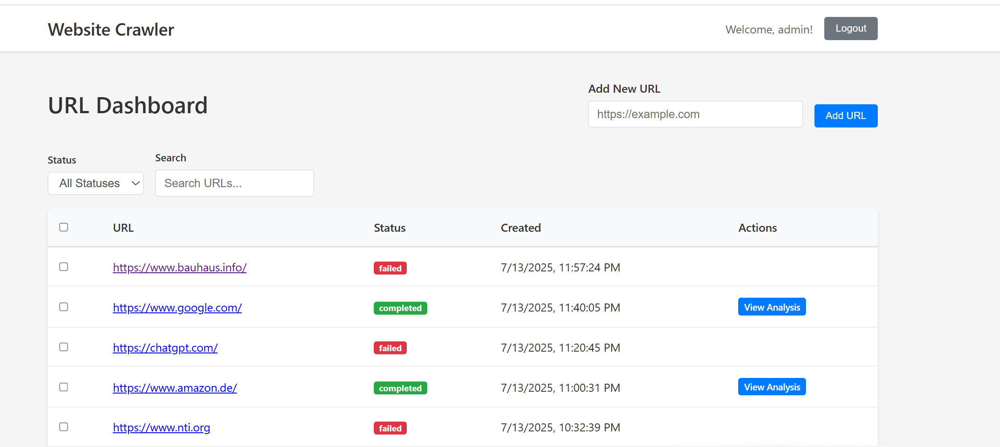
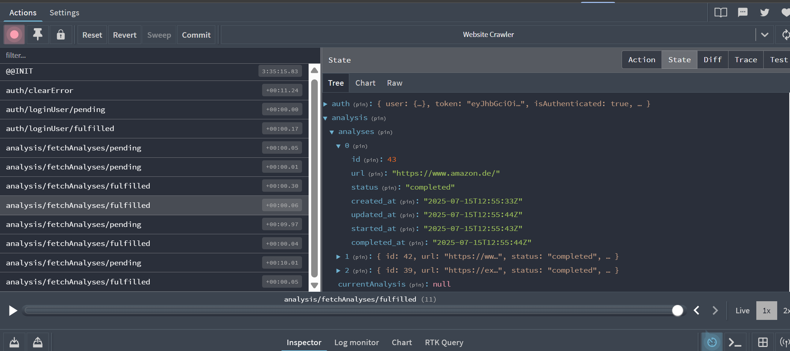

# Website Crawler - Full Stack Application

A web application that accepts website URLs, crawls them, and displays key information about the pages.

## Features

- **URL Management**: Add URLs for analysis and control processing
- **Real-time Progress**: Track crawl status (queued → running → done/error)
- **Dashboard**: Paginated, sortable table with filters and search
- **Details View**: Charts and detailed analysis of crawled pages
- **Bulk Actions**: Re-run analysis or delete selected URLs

## Screenshot



## Tech Stack

### Frontend
- React 18 with TypeScript
- Modern CSS with CSS Modules (no Tailwind)
- React Router for navigation
- Chart.js for data visualization
- Axios for API communication

### Backend
- Go with Gin framework
- MySQL for data storage
- JWT for API authorization
- Go modules for dependency management

## State Management

The application uses **Redux Toolkit** for state management with three main slices:

- **Auth Slice**: Handles user authentication state and JWT tokens
- **Analysis Slice**: Manages URL analysis data and processing status
- **URL Slice**: Controls URL list, pagination, and bulk operations

### Redux DevTools Integration

The application is configured with Redux DevTools for development debugging:



*Note: Redux DevTools extension is required in your browser to view the state management in real-time.*

## Project Structure

```
sykell-crawler/
├── frontend/          # React TypeScript application
├── backend/           # Go API server
├── database/          # MySQL schema and migrations
└── docker-compose.yml # Development environment
```

## Quick Start

### Prerequisites
- Node.js 18+ and npm
- Go 1.21+
- MySQL 8.0+
- Docker and Docker Compose (optional)

### Option 1: Docker (Recommended)

1. Clone the repository:
```bash
git clone <repository-url>
cd sykell-crawler
```

2. Start the development environment:
```bash
docker-compose up -d
```

3. Access the application:
- Frontend: http://localhost:3000
- Backend API: http://localhost:8080
- Database: localhost:3306

### Option 2: Local Development

1. **Setup Database**:
```bash
# Start MySQL (adjust for your system)
mysql -u root -p
CREATE DATABASE crawler_db;
CREATE USER 'crawler_user'@'localhost' IDENTIFIED BY 'crawler_password';
GRANT ALL PRIVILEGES ON crawler_db.* TO 'crawler_user'@'localhost';
FLUSH PRIVILEGES;
```

2. **Setup Backend**:
```bash
cd backend
go mod download
go run main.go
```

3. **Setup Frontend**:
```bash
cd frontend
npm install
npm start
```

## API Documentation

### Authentication
All API requests require a JWT token in the Authorization header:
```
Authorization: Bearer <token>
```

### Endpoints

#### URLs
- `GET /api/urls` - List all URLs with pagination
- `POST /api/urls` - Add new URL for crawling
- `PUT /api/urls/:id/status` - Update URL status
- `DELETE /api/urls/:id` - Delete URL
- `POST /api/urls/bulk-delete` - Bulk delete URLs
- `POST /api/urls/bulk-rerun` - Re-run analysis for selected URLs

#### Analysis
- `GET /api/analysis/:id` - Get detailed analysis results
- `GET /api/analysis/:id/links` - Get broken links for URL

## Development

### Frontend Development
```bash
cd frontend
npm run dev          # Start development server
npm run build        # Build for production
npm run test         # Run tests
npm run test:watch   # Run tests in watch mode
```

### Backend Development
```bash
cd backend
go run main.go       # Start development server
go test ./...        # Run tests
go mod tidy          # Clean up dependencies
```

### Database Migrations
```bash
cd database
mysql -u crawler_user -p crawler_db < schema.sql
```

## Testing

### Frontend Tests
- Unit tests for components
- Integration tests for API calls
- E2E tests for critical user flows

### Backend Tests
- Unit tests for business logic
- Integration tests for API endpoints
- Database tests with test containers

## Deployment

### Production Build
```bash
# Frontend
cd frontend
npm run build

# Backend
cd backend
go build -o main main.go
```

### Environment Variables
```bash
# Backend
DB_HOST=localhost
DB_PORT=3306
DB_NAME=crawler_db
DB_USER=crawler_user
DB_PASSWORD=crawler_password
JWT_SECRET=your-secret-key
CORS_ORIGIN=http://localhost:3000

# Frontend
REACT_APP_API_URL=http://localhost:8080
```


